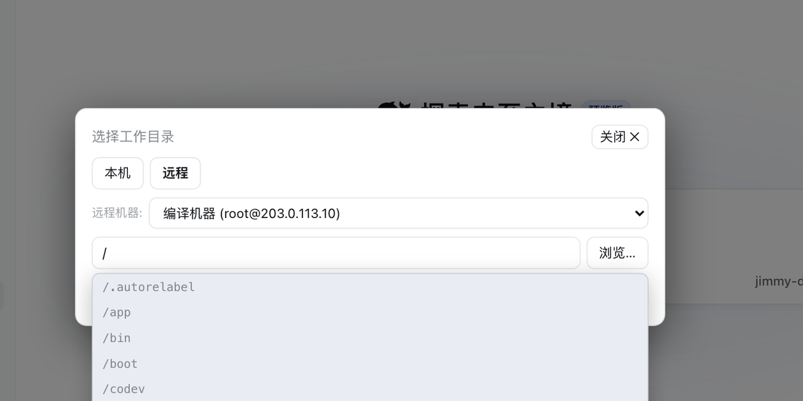

**English** · [中文](./README.md)

---

# dsh-remote

[](https://www.npmjs.com/package/dsh-remote)
[](https://www.npmjs.com/package/dsh-remote)
[](https://www.npmjs.com/package/dsh-remote)
[](LICENSE)
[](https://github.com/topics/dsh-plugin)

Maintained by [@flymysql](https://github.com/flymysql) · [Homepage](https://flymysql.github.io/dsh-remote/) · [Usage stats](https://flymysql.github.io/dsh-remote/stats/) · [Blog](https://gitpull.cn) · [Discussions](https://github.com/flymysql/dsh-remote/discussions) · [Issues](https://github.com/flymysql/dsh-remote/issues) · [中文说明](./README.md)



**Remote-work assistant for [DeepSeek Harness](https://github.com/deepseek-ai/deepseek-harness) (DSH).**

Manage several SSH machines, then pick a **remote workspace** (or a **local** one) and let the agent operate right there without leaving the harness — listing files, reading code, running builds & commands over the remote host, and keeping that remote directory mirrored into a real local workspace object.

The harness Web UI intentionally binds `127.0.0.1` (the CLI rejects `--host 0.0.0.0` for safety). This plugin goes the other way: **you connect out** to the machines you maintain, pick a workspace, and work in it through the normal DSH workspace + agent fs flows — no changes to `dsh-workspace` or the harness core.

It works the other way too: **you can open the remote machine's own DSH Web UI as a page in your local browser** — again without exposing any port on the remote. And when a connection will not come up, a **one-click health check & deploy** repairs and verifies the remote environment for you.

## Screen previews

**Settings → 远程工作区** — machine list, advanced config (key / jump host / agent), connection check, port forwarding, audit log, update:


The native **"Add workspace"** flow — a centered modal with two tabs, opening on Local; here switched to **Remote**:


- The path field autocompletes live; on Windows hosts the root shows a multi-drive view; the floating browser fills the field without committing.
- On confirm a **real local mirror** is created and adopted by the harness, kept in sync over SFTP; the choice persists on the machine.

---

## Features


The image above is the overview. What follows is only what the image does not make obvious.

**Workspace picker** (fills the native "Add workspace" flow) — Local uses the system folder chooser; Remote browses inside the modal:


- The path field autocompletes live; on Windows hosts the root shows a multi-drive view; the floating browser fills the field without committing.
- On confirm a **real local mirror** is created and adopted by the harness, kept in sync over SFTP; the choice persists on the machine.

**Settings** (machine list, connection check, port forwarding, audit log, update mode):


The rest:

- **22 model tools** (listed so they can be copied or searched): `rw_info`, `rw_connect`, `rw_machines`, `rw_pick_workspace`, `rw_list_dir`, `rw_stat`, `rw_read_file`, `rw_write_file`, `rw_edit`, `rw_append`, `rw_mkdir`, `rw_remove`, `rw_move`, `rw_exec`, `rw_search`, `rw_download`, `rw_upload`, `rw_sync`, `rw_push`, `rw_forward`, `rw_disconnect`, `rw_deploy_probe`.
- **Tell local and remote Sessions apart in the sidebar** (`0.8.43+`) — a remote Session row carries a **green dot** and its hover card names `user@host:port` plus the remote path; opening it also shows a host chip in the conversation header (a local Session shows neither). A Session counts as remote only when its cwd sits inside a `$DSH_HOME/remote-workspaces/…` mirror, so a machine that is merely saved never labels a local Session.
- **Open a remote machine's DSH Web UI locally** (`0.8.36+`) — nothing has to be exposed on the remote: the plugin SSHes out, starts a `dsh web` there that binds **`127.0.0.1` only**, and tunnels its port back to a loopback port on this machine. The URL carries a one-time login token, consumed once by a redirect.
- **One-click health check & deploy** (`0.8.36+`) — **a failed connection is usually the remote dsh version or environment, not the plugin.** The read-only check reports platform / node / npm / dsh version / **whether the native module can load** / proxy and npm registry, with a suggested fix; "Deploy & verify" installs into a remote **private directory** (no system directory, no PATH change, no replacing the version you use — deleting it is a complete rollback) and verifies step by step. The button **no longer requires running the check first** (`0.8.40+`) — the deploy re-checks internally. If that still fails, the built-in `dsh-remote-deploy` skill takes over.
- **Cross-platform remotes** — all file access is SFTP-protocol-level (no POSIX shell), so Linux/macOS/Windows remotes all work.
- **Windows remotes** — the platform is auto-detected and commands go through `bash -s` over stdin, so quoting and backslash escaping are never an issue (`config.shell` can pin a path or `native` disables wrapping); `C:\Users\dev` and `/c/Users/dev` are both accepted.
- **Async long tasks** — `rw_sync`/`rw_push` with `async: true` return a `taskId` with progress/result/cancel.
- **Data lives under the harness home** — machines and mirrors follow `$DSH_HOME`; pre-0.6 data migrates automatically on first run.
- **No `dsh-workspace` core changes** — everything ships as a normal plugin.

## Install

### DSH version compatibility

Runs on **both** the `0.1.x` and `0.2.x` DSH lines. DSH validates every `@deepseek-ai/dsh-*` peer range *before* importing a bundle and **drops the whole bundle** when any range does not match (no settings panel, no `rw_*` tools):

```
dsh: skipping profile bundle "dsh-remote": Error: Plugin dsh-remote@… is incompatible …
```

A caret on `0.x` is locked to that minor line (`^0.1.x` cannot admit `0.2.x`, and vice versa), so since **0.8.29** the ranges are cross-line intervals: `>=0.1.0-rc.6 <0.3.0`. **If you are below 0.8.29, upgrade the plugin before you upgrade DSH.**

### Official Desktop compatibility (experimental)

A compatibility path for the [official DeepSeek Harness Desktop](https://github.com/deepseek-ai/deepseek-harness), tested against the `0.1.5-rc.2` Host transport; it does not replace the harness core or require a listening Web server:

- SSH settings and the directory picker use `/api/dsh-remote/*` over the Desktop's `dsh-app:` carrier (registered on `ctx.connection.fetch`).
- A native Remote Files entry uses `sidebarRightTabs`, giving remote files session-scoped resource addresses instead of sending remote paths to the local Files viewer.
- `dsh-better-sidebar` is not bundled; official Desktop uses the native right sidebar.

Verified: host startup, IPC requests, real SSH read-only connect/list/read, and per-session routing (sidebar `/ls` `/read` `/write` `/fs` with `sessionId`). The native file-tab GUI, failed/cancelled dialogs and non-macOS hosts remain experimental. The Desktop installer may need an explicit policy for the optional `ssh2` / `cpu-features` build scripts.

### Published Web bundle

```bash
dsh plugin add dsh-remote
```

Since **v0.8.18** it installs and mounts only itself; the Web sidebar ([dsh-better-sidebar](https://www.npmjs.com/package/dsh-better-sidebar)) is optional. Install it separately if you want the Web remote file explorer/editor — without it the `rw_*` tools, settings UI, sync, audit log and port forwarding all still work.

> **Upgrading from 0.7.2–0.8.17:** the embedded sidebar goes away; any old profile override for `id: dsh-remote-sidebar` can be removed.

(or `npm install dsh-remote` + add `- id: dsh-remote / name: dsh-remote` in `cordis.patch.yml`).

## Quick start

1. **Add a machine** — Settings → 远程工作区 → host/port/user + key or password → set it current.
2. **Open a workspace** — click **Add workspace** in the sidebar / conversation:
   - **Local** → system folder chooser (or type a path) → local workspace. Falls back to the in-app browser when no OS dialog exists.
   - **Remote** → choose the machine → browse to a remote directory (or type `/path`) → "设为远程工作区" ⇒ a local mirror workspace is created and adopted.
3. **Work with the agent** — treat it like any workspace: `rw_read_file` / `rw_write_file` / `rw_edit` / `rw_exec` / `rw_search` / `rw_sync` / `rw_push` / `rw_forward` (full list above).

> **Remote context is session-scoped:** the "Remote workspace" system-prompt section appears only when the current session's workspace is a remote mirror; local sessions are unaffected and the model will not call `rw_*` on its own.

## Open a remote machine's DSH Web UI locally

The `dsh web` running on a remote machine can also be opened **as a page on this machine** (issue #46). The direction stays "this machine dials out":

> **The remote opens no port.** DSH deliberately refuses `--host 0.0.0.0` (it would put remote
> code execution on the network), so the correct shape is: SSH out, start a `dsh web` on the remote
> that listens on **127.0.0.1 only**, and carry its port back over the SSH connection to a loopback
> port here.

Usage: Settings → Remote workspaces → **"Remote DSH Web UI"** → pick a machine → **Connect & open**.
A new tab opens showing that remote machine's full DSH interface (chat, tool tree, settings).

- The URL looks like `http://127.0.0.1:3088/?token=…`. That token is a one-time credential the remote
  process prints at startup and is used once, on this machine, by that redirect: DSH exchanges it for a
  30-day signed cookie and lands on a clean `/`. **Do not share that tokenized URL.**
- "Disconnect" only closes the tunnel and deliberately does **not** kill the remote process (it may be
  an instance you use elsewhere). "Disconnect & stop remote" also ends the process — but only one this
  plugin started.
- If the remote already runs an interface (for example one you started in a terminal), pick the machine
  and paste its `http://127.0.0.1:<port>/?token=…` into the field, then "Attach to running instance" —
  no second instance will be started.
- When the remote `dsh` is not on the SSH login PATH, point `webAttachCommand` at its absolute path; to
  keep an attached instance out of the remote user's own sessions and settings, point `webAttachDshHome`
  at a scratch directory.

### Cannot connect? Check the environment, then deploy in one click

**A failed connect is usually not the plugin's fault: the remote dsh version or environment is wrong.**
The classic case: dsh 0.1.0-rc.6 depends on `node-pty@1.1.0`, whose published package ships
**no `linux-x64` prebuild**, so `dsh web` cannot start on Linux at all. Previously all you saw was
"the remote DSH did not report a startup token", with no way to tell why.

Settings → Remote workspaces → **"Remote dsh health check & deploy"**:

1. **Check (read-only)** — probes the remote's platform / node / npm / dsh version / **whether the
   native module can load** / whether it knows `--no-open` / proxy and npm registry, and reports a
   verdict with a suggested fix. It **writes nothing**, so it is safe to run freely.
2. **Deploy & verify** — appears only when step 1 says it is both needed and possible. It installs into
   a **private directory** on the remote (default `~/.dsh-remote/dsh`): **no system directory, no PATH
   change, no replacing the version you use**; deleting that directory is a complete rollback. It then
   verifies step by step (binary / native module / `web` subcommand) and, on success, **records the
   resulting dsh path per machine** so later connects use it.
3. **Let the AI investigate** — appears only after a failure. It creates a session and hands the problem
   to the built-in `dsh-remote-deploy` skill, which covers the long tail the deterministic path cannot
   express (no npm, sudo-only systems, proxies, internal mirrors, Windows remotes). **Nothing is created
   unless you click it**, because it spends model budget.

Related config: `webInstallPrefix` (where; default `$HOME/.dsh-remote/dsh`), `webInstallVersion`
(which version; default `0.1.5-rc.2`, the first that can start the web surface on Linux), and
`webInstallRegistry` (npm registry; **empty keeps the remote's own config**, so an internal mirror is
never overridden).

## CLI defaults (optional)

Provide a default machine in `cordis.patch.yml`:

```yaml
# Example only — use values for your own machine.
- id: dsh-remote
  name: dsh-remote
  config:
    host: 203.0.113.10   # or your real host / hostname
    port: 22
    username: dev
    privateKeyPath: ~/.ssh/id_rsa
    # or password: '…'
    workspace: ~/project
```

If `host` is empty the plugin starts disconnected and you configure machines in the UI.

## CLI quick reference

Installing and driving DSH may live in different shells, so both the `dsh` binary and the `npx` form are shown. Always tell DSH **which profile** to use with `--profile <name>` (usually `web`).

```bash
# install the bundle into a profile (npm is pulled by pnpm; recommended)
dsh plugin --profile web add dsh-remote
# same but when `dsh` is not on PATH (e.g. Windows PowerShell inside a repo)
npx --yes @deepseek-ai/dsh plugin --profile web add dsh-remote

# confirm it is installed wire
dsh plugin --profile web list
npx --yes @deepseek-ai/dsh plugin --profile web list

# start the web surface (reload profile; the plugin activates on boot)
dsh --profile web
npx --yes @deepseek-ai/dsh --profile web   # http://127.0.0.1:3080

# use a local checkout instead of the npm version (dev iteration)
npx --yes @deepseek-ai/dsh plugin --profile web add /path/to/dsh-remote
npx --yes @deepseek-ai/dsh plugin --profile web remove dsh-remote   # back to release
```

After a successful start, `Settings → 远程工作区` appears and the "Add workspace" flow gains the 本机 / 远程 tabs (screenshots above).

## Development (sandbox, not product)

Iterate in the sandbox — hand-editing a product profile is reverted by the plugin manager on reinstall:

```bash
scripts/dev-run.sh --restart   # start / restart the isolated sandbox
scripts/dev-run.sh --stop      # stop it
scripts/dev-run.sh --status    # is it running?
```

- The sandbox runs its own DSH instance (`dev-harness/harness`), serving on `http://127.0.0.1:50599`.
- **Host-half** (`lib/index.js`) changes need `--restart`; **client-half** (`lib/client.js`) changes need only a page refresh.
- The script hardlink-copies `lib/` into the sandbox rather than symlinking — a symlink breaks `@deepseek-ai/*` resolution.
- Before committing: `node check.mjs` (framework-constraint gate) and `npm test`; `scripts/boot-smoke.sh` proves the plugin still starts.
- Full rules live in `scripts/dev-standards.md`.

Deploying to a product profile is a separate, explicit action (`./sync.sh`) for releases only.

## Configuration

| Key | Type | Default | Meaning |
| --- | --- | --- | --- |
| `host` | string | `''` | default SSH host (else start disconnected) |
| `port` | int | `22` | default SSH port |
| `username` | string | `''` | default SSH user |
| `password` | string | `''` | default SSH password (non-empty overrides key) |
| `privateKeyPath` | string | `''` | private key path (used only when explicitly provided) |
| `passphrase` | string | `''` | passphrase for an encrypted private key |
| `workspace` | string | `''` | default remote workspace path |
| `shell` | string | `''` | remote command terminal strategy: `''`=auto-detect (Git Bash on Windows remotes), `'git-bash'`=prefer Git Bash, `'native'`=never wrap, anything else=explicit bash.exe path (e.g. `C:\Program Files\Git\bin\bash.exe`) |
| `commandTimeoutMs` | int | 20000 | per remote command timeout |
| `connectTimeoutMs` | int | 15000 | SSH connect timeout |
| `maxOutputChars` | int | 200000 | cap on captured stdout/stderr per remote command |
| `maxFileBytes` | int | 52428800 | skip mirroring/reading files larger than this (0 = no cap) |
| `hostKeyMode` | string | `accept-new` | host-key policy: `accept-new` (TOFU), `verify` (reject unknown hosts), `off` (skip) |
| `useAgent` | bool | `false` | authenticate via the OpenSSH agent (`SSH_AUTH_SOCK`) |
| `keyboardInteractive` | bool | `false` | allow keyboard-interactive auth (OTP/MFA) with the configured password |
| `proxy` | object | — | jump host: `{ host, port?, username?, password?, privateKeyPath? }` |
| `autoPush` | bool | `false` | auto-push edited mirror files back to the remote (watcher, debounced) |
| `auditLog` | bool | `true` | append executed commands to `$DSH_HOME/remote-workspaces/audit.log` |
| `encoding` | string | `utf-8` | text encoding for remote file reads/writes (e.g. `gbk`) |
| `fileReference` | bool | `true` | remote `@` completion: in a remote session `@` lists the **remote** tree over SFTP (issue #39); off → only the local mirror |
| `fileReferenceMaxResults` | int | `20` | max `@` candidates rendered for one query |
| `fileReferenceMaxEntries` | int | `3000` | max entries retained in one remote workspace's `@` index |
| `fileReferenceExcludedDirectories` | string[] | `[.git, node_modules, dist, build, out, coverage, target, .next, .nuxt, .turbo, .venv, __pycache__, .pytest_cache, .mypy_cache, .gradle]` | directory basenames the remote `@` traversal skips |
| `fileReferenceTimeoutMs` | int | `4000` | wall-clock budget for one remote `@` index pass (on expiry the partial index answers rather than making the caret wait) |
| `searchTimeoutMs` | int | `60000` | Cooperative budget (ms) for `rw_search`: declared as the tool's `timeoutMs` for DSH's timeout policy and used as the search's own wall-clock cap; on expiry it returns partial results marked `TRUNCATED` (issue #44). |
| `searchMaxEntries` | int | `50000` | Max files `rw_search` scans before returning partial results. |
| `updateMode` | string | `auto` | self-update behaviour: `auto` checks npm on load and every 6h and applies a newer release; `manual` only checks when asked; `off` disables checks. **Default changed to `auto` in 0.8.27** — safe because 0.8.24 added the host-half hot swap |
| `updateCheckIntervalMs` | int | 21600000 (6h) | how often `auto` mode checks npm (floor 60000) |
| `updateAutoReload` | bool | `true` | hot-swap the host half after an update lands; `false` defers it to the next process start and the panel reports `pendingReload` |
| `webAttachPortStart` | int | `3088` | first local port for the "Remote DSH Web UI" tunnel (later ports are tried when taken; loopback only) |
| `webAttachCommand` | string | `dsh` | command used to start `dsh web` on the remote; change it when the remote `dsh` is not on the SSH login PATH |
| `webAttachDshHome` | string | `''` | `DSH_HOME` exported on the remote when attaching; empty reuses the remote user's own harness home |
| `webAttachWaitSeconds` | int | `45` | how long to wait for a freshly started remote `dsh web` to print its launch token |
| `webInstallPrefix` | string | `''` | where an automatic deployment installs dsh; empty means `$HOME/.dsh-remote/dsh` (no system directory, no PATH change) |
| `webInstallVersion` | string | `0.1.5-rc.2` | dsh version an automatic deployment installs; the default is the first that can start the web surface on Linux |
| `webInstallRegistry` | string | `''` | npm registry for the install; **empty keeps the remote's own config**, so an internal mirror is never overridden |

> The authoritative list is the `Config` schema in `lib/index.js`; this table mirrors it.

## FAQ / troubleshooting

**`@` lists remote files but the built-in read tool cannot open them** — the harness's own file tools see the **local mirror**, which stays empty until `rw_sync` downloads it. Read remote files with `rw_read_file` or the sidebar remote tab.

**Host key changed** — `/remote forget-key` (or Settings → machine → trust again).

**"Authentication failed"** — check the username/password/key path; fill in the passphrase for an encrypted key; enable keyboard-interactive when the host requires OTP.

**Cannot reach an internal machine** — set a jump host (or add the bastion as its own machine first).

**`rw_sync`/`rw_push` reports conflicts** — files changed on both sides are skipped and listed (never silently overwritten); merge manually and retry, or pass `force=true`.

**Windows remotes** — everything goes over SFTP, no POSIX shell needed; read Chinese files with `encoding=gbk`.

**A directory is missing from the mirror** — the default ignore rules skip `.git`/`node_modules` and similar; adjust `$DSH_HOME/remote-workspaces/.dsh-remote-ignore` (gitignore syntax).

**Saving a remote file returns 409** — the remote file changed after you opened it; re-read and edit again.

**How are passwords stored?** — tick "encrypt password": macOS Keychain / Windows DPAPI / Linux secret-tool (libsecret); falls back to plaintext when unavailable.

**The plugin vanished after a DSH upgrade** — DSH's compatibility check dropped the bundle; upgrade to **0.8.29+** (see "DSH version compatibility" above).

**"Remote DSH Web UI" will not connect / spins forever** — first check that `dsh web` starts on that
machine *at all*. Two known traps (the plugin names them in its error):
1. **dsh 0.1.0-rc.6 cannot start the web surface on Linux** — the `node-pty@1.1.0` it depends on ships
   macOS/Windows prebuilds but **no `linux-x64`**, so it fails with `Failed to load native module:
   pty.node`. Upgrade to 0.1.5-rc.2+ (its `node-pty@1.2.0-beta.15` ships the Linux build).
2. **dsh 0.1.0-rc.6 does not know `--no-open`** (the flag came later); the plugin drops it and retries
   once automatically, so there is nothing to do.
If the remote `dsh` is not on the SSH login PATH (a private prefix, say), point `webAttachCommand` at
its absolute path.

## Safety

Giving the plugin a machine's credentials lets the agent run **shell commands as your user** on that host — only add machines you trust. Passwords live in a local file (or the OS keychain); treat them as sensitive. With `auditLog` on, every command is recorded.

## License

MIT

## Contributing

Contributions are welcome — see [CONTRIBUTING.md](./CONTRIBUTING.md). Questions, setups and "is this supported?" go to [Discussions](https://github.com/flymysql/dsh-remote/discussions); reproducible bugs go to [Issues](https://github.com/flymysql/dsh-remote/issues).

Thanks to everyone who has landed a change here (merged PRs in parentheses):

[@dahaipeng](https://github.com/dahaipeng) (#31) ·
[@YiHui-Liu](https://github.com/YiHui-Liu) (#28) ·
[@nekomona](https://github.com/nekomona) (#24) ·
[FoolishWiser](https://github.com/FoolishWiser) (#17) ·
[@jace1cch](https://github.com/jace1cch) (#16) ·
[@Minggle](https://github.com/Minggle) (#10) ·
[4FMTWRV](https://github.com/4FMTWRV) (#6) ·
[glzhangzhi](https://github.com/glzhangzhi) (per-session SSH pool fix)

## Changelog

See [CHANGELOG.md](./CHANGELOG.md).
